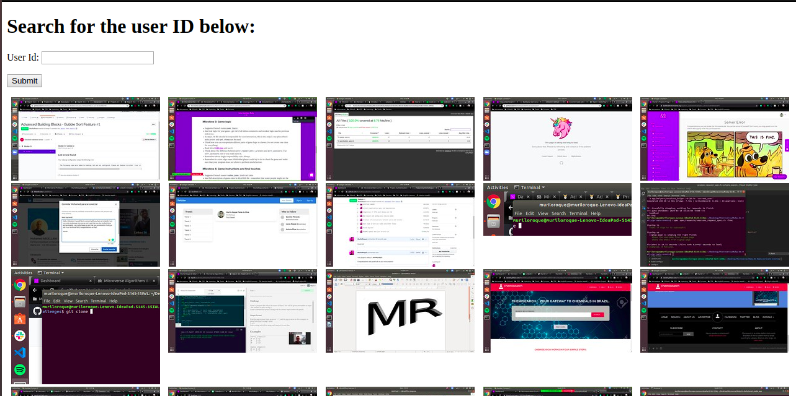

 

# Photo Widget App (Flickr API)

First of all, you can find this project's tutorial [here](https://www.theodinproject.com/courses/ruby-on-rails/lessons/apis).

In this project I:

- Used Ruby to implement a photo widget app using Flickr API;
- Used HTML and CSS to create the views;
- Used Flickr API to get photos from Flickr;
- Used Figaro gem for my secret and ID protection;
- Used flickraw gem to get helper methods to get the user and display his/her photos;
- Set up a code linter in the repository;
- Used gitflow;
- Created an effective Ruby code that solved the problem;
- Applied Ruby coding best practices;
- Implemented basic OOP principles;
- Have an organized project structure;
- Used common Ruby patterns;
- Chose a simple solution over a more complex one.

# What it does

When the App is executed, you can search for an user's ID and display his Flickr's photos. For an easy example, you can use my Flickr ID: 188655404@N06.

## Built with

Ruby on Rails, HTML and CSS.

## Live Demo

Not avaiable at the moment, it will be in here a future feature.

## Getting Started

- Clone the project to your local machine;
- `cd` into the project directory;
- Run `bundle install` to install the necessary gems;
- Run `rails s` to start a server in your computer;
- In your browser address, type the following URL: [localhost:3000](localhost:3000);
- Enjoy the App and its functionalities!

## Author

Murilo Roque Paiva da Silva

Github: [@MuriloRoque](https://github.com/MuriloRoque)

Twitter: [@MuriloRoquePai1](https://twitter.com/MuriloRoquePai1)

Linkedin: [MuriloRoque](https://www.linkedin.com/in/murilo-roque-b1268741/)

## 🤝 Contributing

Contributions, issues and feature requests are welcome! Start by:

- Forking the project
- Cloning the project to your local machine
- `cd` into the project directory
- Run `git checkout -b your-branch-name`
- Make your contributions
- Push your branch up to your forked repository
- Open a Pull Request with a detailed description to the development branch of the original project for a review

## Show your support

Give a ⭐️ if you like this project!
